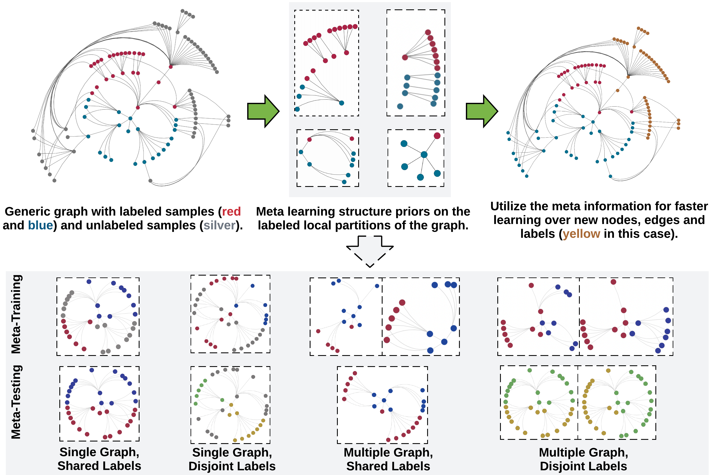

# Hyperbolic Graph Neural Networks at Scale: A Meta Learning Approach

Hyperbolic neural networks (HNNs) have outperformed their Euclidean counterparts in several domains that involve hierarchical datasets including recommender systems, biology, and knowledge graphs. However, current research in the domain is limited due to HNNs’ lack of inductive bias mechanisms that could help it generalize well over unseen tasks or enable scalable learning over large datasets. In this paper, we aim to alleviate these issues by learning generalizable structure priors from the nodes’ local subgraph and transfer them for faster learning over new subgraphs with a disjoint set of nodes, edges and labels in a few-shot setting. We theoretically justify that HNNs predominantly rely on local neighborhoods for label prediction evidence of a target node or edge, and hence, we learn the model parameters on local graph partitions, instead of the earlier approach that considers the entire graph together. 
We introduce a novel Hyperbolic GRAph Meta Learner (H-GRAM) that learns transferable information from a set of support local subgraphs, in the form of hyperbolic meta gradients and label hyperbolic protonets, to enable faster learning over a query set of new tasks dealing with disjoint subgraphs. Furthermore, we show that an extension of our meta-learning framework also solves the limitation of scalability in hyperbolic neural networks faced by
earlier approaches. Our comparative analysis shows that H-GRAM effectively learns and transfers information in multiple challenging few-shot settings compared to other state-of-the-art baselines. Additionally, we demonstrate that, unlike standard HNNs, our model is able to efficiently scale over large standard graph datasets and improve performance over its Euclidean counterparts. Furthermore, we also evaluate the utility of various meta information components through an ablation study and analyze the scalability of our algorithm over different few-shot learning scenarios.



## Run
```bash
cd HGRAM
# Single graph disjoint label, node classification (e.g. arxiv-ogbn)
python train.py --data_dir DATA_PATH --task_setup Disjoint
# Multiple graph shared label, node classification (e.g. Tissue-PPI)
python train.py --data_dir DATA_PATH --task_setup Shared
# Multiple graph disjoint label, node classification (e.g. Fold-PPI)
python train.py --data_dir DATA_PATH --task_setup Disjoint
# Multiple graph shared label, link prediction (e.g. FirstMM-DB, Tree-of-Life)
python train.py --data_dir DATA_PATH --task_setup Shared --link_pred_mode True
```

It also supports various parameters input:

```bash
python train.py --data_dir # str: data path
                --task_setup # 'Disjoint' or 'Shared': task setup, disjoint label or shared label
                --link_pred_mode # 'True' or 'False': link prediction or node classification
                --batchsz # int: number of tasks in total
                --epoch # int: epoch size
                --h # 1 or 2 or 3: use h-hops neighbor as the subgraph.
                --hidden_dim # int: hidden dim size of GNN
                --input_dim # int: input dim size of GNN
                --k_qry # int: number of query shots for each task
                --k_spt # int: number of support shots for each task
                --n_way # int: number of ways (size of the label set)
                --meta_lr # float: outer loop learning rate
                --update_lr # float: inner loop learning rate
                --update_step # int: inner loop update steps during training
                --update_step_test # int: inner loop update steps during finetuning
                --task_num # int: number of tasks for each meta-set
                --sample_nodes # int: when subgraph size is above this threshold, it samples this number of nodes from the subgraph
                --task_mode # 'True' or 'False': this is specifically for Tissue-PPI, where there are 10 tasks to evaluate.
                --num_worker # int: number of workers to process the dataloader. default 0.
                --train_result_report_steps # int: number to print the training accuracy.
```

To apply it to the five datasets reported in the paper, using the following code as example after you download the processed datasets from the section below.

**arxiv-ogbn**:
<details>
<summary>CLICK HERE FOR THE CODE!</summary>

```
python HGRAM/train.py --data_dir PATH/arxiv/ \
                            --epoch 10 \
                            --task_setup Disjoint \
                            --k_spt 3 \
                            --k_qry 24 \
                            --n_way 3 \
                            --update_step 10 \
                            --update_lr 0.01 \
                            --num_workers 0 \
                            --train_result_report_steps 200 \
                            --hidden_dim 256 \
                            --update_step_test 20 \
                            --task_num 32 \
                            --batchsz 10000 
```
</details>

**Tissue-PPI**:
<details>
<summary>CLICK HERE FOR THE CODE!</summary>

```
python HGRAM/train.py --data_dir PATH/tissue_PPI/ \
                            --epoch 15 \
                            --task_setup Shared \
                            --task_mode True \
                            --task_n 4 \
                            --k_qry 10 \
                            --k_spt 3 \
                            --update_lr 0.01 \
                            --update_step 10 \
                            --meta_lr 5e-3 \
                            --num_workers 0 \
                            --train_result_report_steps 200 \
                            --hidden_dim 128 \
                            --task_num 4 \
                            --batchsz 1000
```
</details>

**Fold-PPI**:
<details>
<summary>CLICK HERE FOR THE CODE!</summary>

```
python HGRAM/train.py --data_dir PATH/fold_PPI/ \
                            --epoch 5 \
                            --task_setup Disjoint \
                            --k_qry 24 \
                            --k_spt 3 \
                            --n_way 3 \
                            --update_lr 0.005 \
                            --meta_lr 1e-3 \
                            --num_workers 0 \
                            --train_result_report_steps 100 \
                            --hidden_dim 128 \
                            --update_step_test 20 \
                            --task_num 16 \
                            --batchsz 4000
```
</details>

**FirstMM-DB**:
<details>
<summary>CLICK HERE FOR THE CODE!</summary>

```
python HGRAM/train.py --data_dir PATH/FirstMM_DB/ \
                            --epoch 15 \
                            --task_setup Shared \
                            --k_qry 32 \
                            --k_spt 16 \
                            --n_way 2 \
                            --update_lr 0.01 \
                            --update_step 10 \
                            --meta_lr 5e-4 \
                            --num_workers 0 \
                            --train_result_report_steps 200 \
                            --hidden_dim 128 \
                            --update_step_test 20 \
                            --task_num 8 \
                            --batchsz 1500 \
                            --link_pred_mod True
```
</details>

**Tree-of-Life**:
<details>
<summary>CLICK HERE FOR THE CODE!</summary>

```
python HGRAM/train.py --data_dir PATH/tree-of-life/ \
                            --epoch 15 \
                            --task_setup Shared \
                            --k_qry 16 \
                            --k_spt 16 \
                            --n_way 2 \
                            --update_lr 0.005 \
                            --update_step 10 \
                            --meta_lr 0.0005 \
                            --num_workers 0 \
                            --train_result_report_steps 200 \
                            --hidden_dim 256 \
                            --update_step_test 20 \
                            --task_num 8 \
                            --batchsz 5000 \
                            --link_pred_mod True
```
</details>

Also, check out the [Jupyter notebook example](test.ipynb).


## Data Processing

We provide the processed data files for five real-world datasets in this [Dropbox file](https://www.dropbox.com/s/gpe8sij29fp76c7/HGRAM_paper_data.zip?dl=0).

1\) To create your own dataset, create the following files and organize them as follows:

- `graph_dgl.pkl`: A list of DGL graph objects. For single graph G, use [G].
- `features.npy`: An array of arrays [feat_1, feat_2, ...] where feat_i is the feature matrix of graph i. 

2.1) Then, for **node classification**, include the following files:
- `train.csv`, `val.csv`, and `test.csv`: Each file has two columns, the first one is 'X_Y' (node Y from graph X) and its label 'Z'. Each file corresponds to the meta-train, meta-val, meta-test set.  
- `label.pkl`: A dictionary of labels where {'X_Y': Z} means the node Y in graph X has label Z.  

2.2) Or, for **link prediction**, note that the support set contains only edges in the highly incomplete graph (e.g., 30% of links) whereas the query set edges are in the rest of the graph (e.g., 70% of links). In the neural message passing, the GNN should ONLY exchange neural messages on the support set graph. Otherwise, the query set performance is biased. Because of that, we split the meta-train/val/test files into separate support and query files. For link prediction, create the following files:
- `train_spt.csv`, `val_spt.csv`, and `test_spt.csv`: Two columns, first one is 'A_B_C' (node B and C from graph A) and the second one is the label. This is for the node pairs in the support set, i.e. positive links should be in the underlying GNN graph.
- `train_qry.csv`, `val_qry.csv`, and `test_qry.csv`:Two columns, first one is 'A_B_C' (node B and C from graph A) and the second one is the label. This is for the node pairs in the query set, i.e. positive links should NOT be in the underlying GNN graph.
- `train.csv`, `val.csv`, and `test.csv`: Merge the above two csv files.
- `label.pkl`: A dictionary of labels where {'A_B_C': D} means the node B and node C in graph A has link status D. D can be 0 or 1 means no link or has link.

We also provide a sample data processing scripts in `data_process` folder. See `node_process.py` and `link_process.py`.

## Cite Us

## Contact

